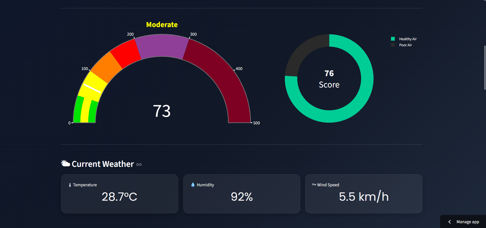
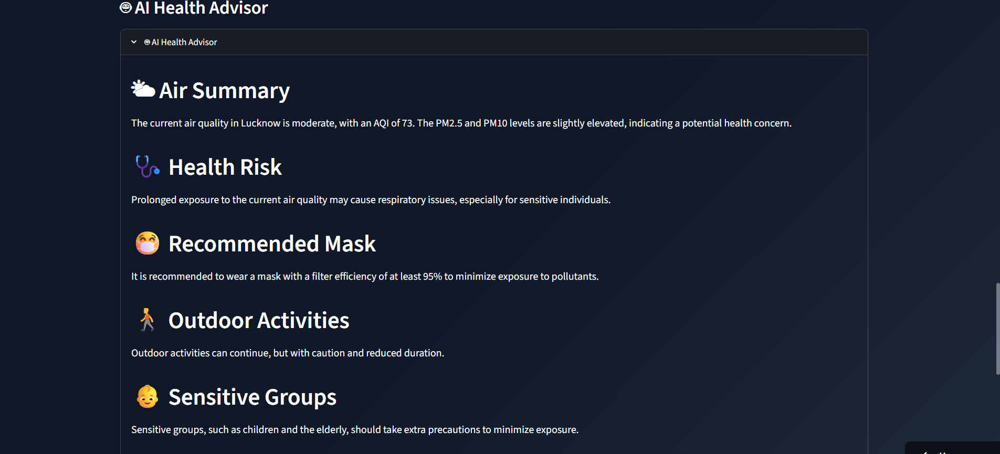

# 🌍 Air Quality Intelligence Dashboard

<div align="center">


### 🚀 Professional Real-Time Air Quality Monitoring Dashboard with AI-Powered Health Recommendations

</div>

---

## 📖 Overview

The **Air Quality Intelligence Dashboard** is a modern web application built with **Streamlit** that provides **real-time Air Quality Index (AQI)** and **weather data** for cities around the world.

Using the **Open-Meteo API**, the dashboard fetches live environmental information, while **Groq Llama 3.3** generates personalized health recommendations based on the current air quality conditions.

Designed with a modern glassmorphism interface, the application helps users understand environmental conditions through interactive visualizations, pollutant analysis, and downloadable PDF reports.

---


# ✨ Features

- 🌍 Search air quality for any city
- 🌡 Live weather information
- 🌫 Real-time AQI monitoring
- 📊 Interactive Plotly charts
- ❤️ Health Score calculation
- 🤖 AI Health Advisor (Groq Llama 3.3)
- 📄 Download Professional PDF Report
- 🎨 Modern Glassmorphism UI
- ⚡ Fast Streamlit caching
- 📱 Responsive dashboard

---

# 📷 Dashboard Preview

> **Add screenshots here after deployment**

| Dashboard | AI Health Advisor |
|-----------|------------------|
|  |  |

---

## 🌐 Live Demo

**Streamlit App:**https://air-quality-analyzer-app-o3igkks59a6bhmkyk94ijp.streamlit.app/

---
# 🛠 Tech Stack

| Category | Technologies |
|----------|--------------|
| Frontend | Streamlit |
| Charts | Plotly |
| Backend | Python |
| AI | Groq (Llama 3.3 70B) |
| APIs | Open-Meteo API |
| PDF | ReportLab |
| Styling | CSS |
| HTTP Requests | Requests |

---

# 📁 Project Structure

```
Air-Quality-Analyzer-App/
│
├── app.py
├── dashboard.py
├── requirements.txt
├── README.md
├── .gitignore
│
├── assets/
│   └── style.css
│
├── utils/
│   ├── __init__.py
│   ├── ai.py
│   ├── api.py
│   ├── charts.py
│   ├── components.py
│   ├── config.py
│   ├── helpers.py
│   └── report.py
│
└── .streamlit/
    └── secrets.toml
```

---

# ⚙ Installation

Clone the repository

```bash
git clone https://github.com/ash972-cpu/Air-Quality-Analyzer-App.git
```

Move into the project folder

```bash
cd Air-Quality-Analyzer-App
```

Create a virtual environment

```bash
python -m venv .venv
```

Activate it

### Windows

```bash
.venv\Scripts\activate
```

### Linux / macOS

```bash
source .venv/bin/activate
```

Install dependencies

```bash
pip install -r requirements.txt
```

Run the application

```bash
streamlit run app.py
```

---

# 🔑 Environment Variables

Create:

```
.streamlit/secrets.toml
```

Add your Groq API key:

```toml
GROQ_API_KEY="YOUR_API_KEY"
```

---

# 📊 APIs Used

## 🌍 Open-Meteo API

- Geocoding
- Air Quality
- Weather Forecast

## 🤖 Groq API

- Llama 3.3 70B
- AI Health Advisor

---

# 📄 PDF Report

The application generates a downloadable professional PDF report containing:

- Location Information
- AQI Summary
- Weather Conditions
- Pollutant Levels
- Health Score
- AI Health Recommendations
- Report Generation Timestamp

---

# 🚀 Future Improvements

- 📍 Interactive map visualization
- 📅 AQI history charts
- 🌎 Multiple language support
- 🔔 Air quality alerts
- ⭐ Favorite cities
- 📈 AQI trend prediction using Machine Learning

---

# 🤝 Contributing

Contributions are welcome.

1. Fork the repository
2. Create a feature branch
3. Commit your changes
4. Push to GitHub
5. Open a Pull Request

---

# 👨‍💻 Author

## Ashish Kumar Mishra

B.Tech Computer Science (Data Science)

Aspiring Data Analyst | Python Developer | Machine Learning Enthusiast

---

# ⭐ Support

If you found this project useful, please consider giving it a ⭐ on GitHub.

It helps others discover the project and motivates future improvements.

---

# 📜 License

This project is licensed under the MIT License.

---

<div align="center">

### 🌍 Making Air Quality Data Smarter with AI

Made with ❤️ using Python, Streamlit, Plotly, Groq AI and Open-Meteo API

</div>
